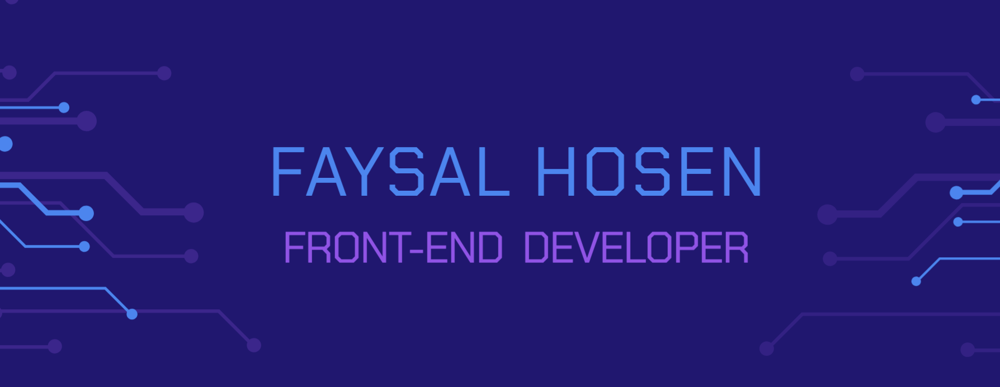

## About me:
👋 Hi, I'm Faysal Hosen, a frontend developer based in Dhaka,Bangladesh. I'm dedicated to creating seamless user experiences using JavaScript and React. I'm passionate about problem-solving, and I find joy in staying at the forefront of tech trends.

💻 With a keen eye for design and a love for clean, efficient code, I bring ideas to life on the web. I'm an avid learner, always exploring new technologies and methodologies to enhance my skills.

## Expertised technologies:

## Three Recent Projects
- news-wave-client
    * Technologies Used: React JS, Express JS, Firebase, MongoDB, Node JS, Tailwind CSS, Daisy UI
    * [Live Link](https://news-wave-af65c.web.app/) 
    * [Client Repository](https://github.com/faysalhosen/news-wave-client) 
    * [Server Repository](https://github.com/faysalhosen/news-wave-server)
- Home-page-exchange
    * Technologies Used: React JS, Express JS, Firebase, MongoDB, Node JS, Tailwind CSS, Daisy UI
    * [Live Link](https://home-page-exchange.web.app/)
    * [Client Repository](https://github.com/faysalhosen/Home-page-exchange-client) 
    * [Server Repository](https://github.com/faysalhosen/Home-page-exchange-server)
- Brand-Shop
    * Technologies Used: React JS, Firebase, Node JS, Tailwind CSS, Daisy UI
    * [Live Link](https://brand-shop-15abe.web.app/)
    * [Repository](https://github.com/faysalhosen/brand-shop-client) 

